# ArKrypt Screenshots

### Mod API Toggles 
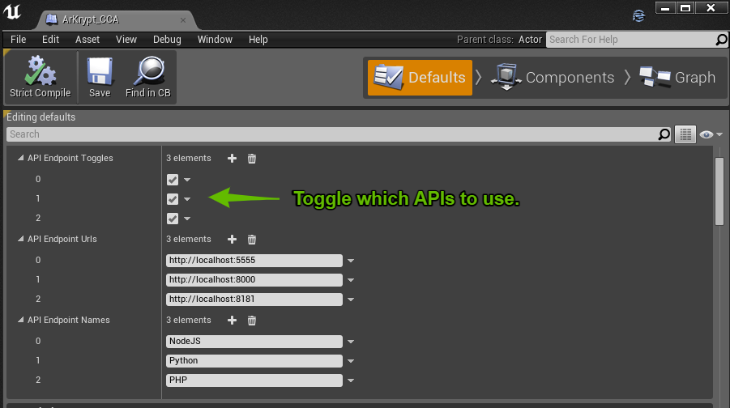  

### Send Message - PIE

### Send Message - NodeJS

### Send Message - Python

### Send Message - PHP
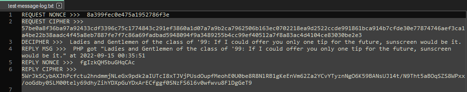

### Demo UI - Player Is... - PIE
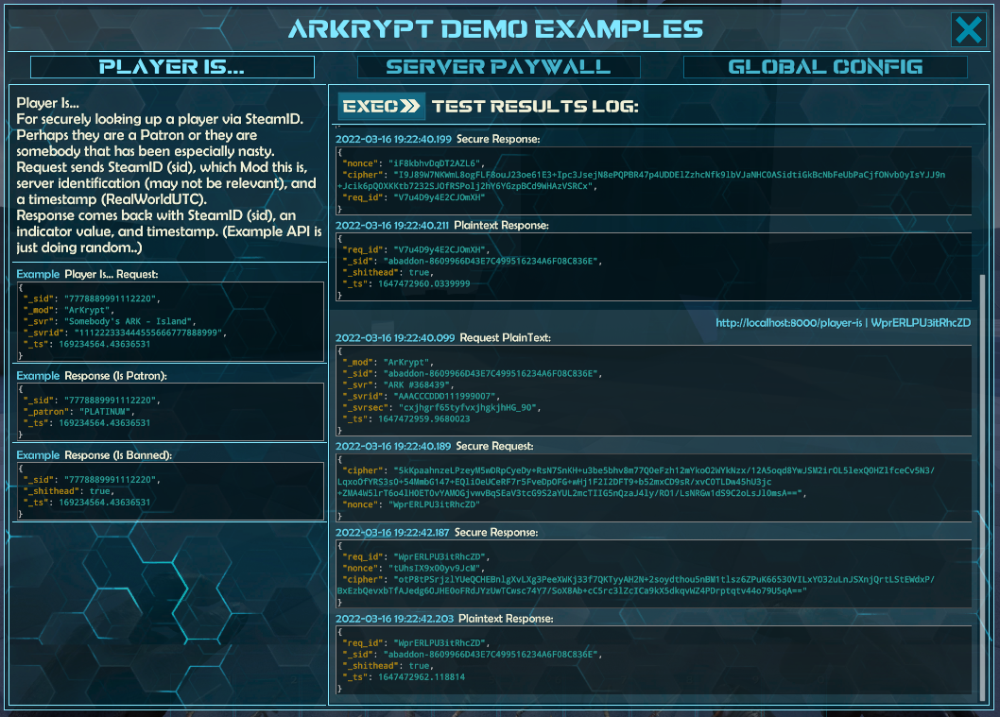
### Demo UI - Player Is... - NodeJS

### Demo UI - Player Is... - Python
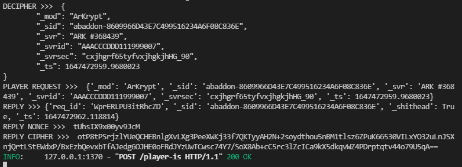
### Demo UI - Player Is... - PHP
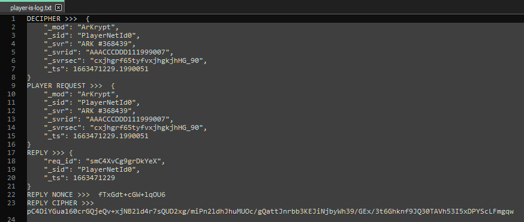

### Demo UI - Server Paywall - PIE
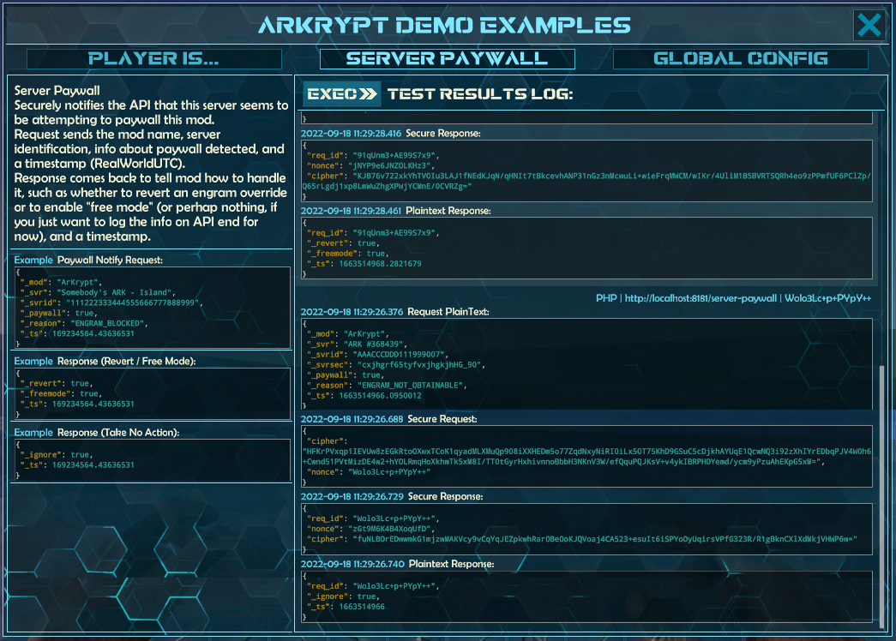
### Demo UI - Server Paywall - NodeJS
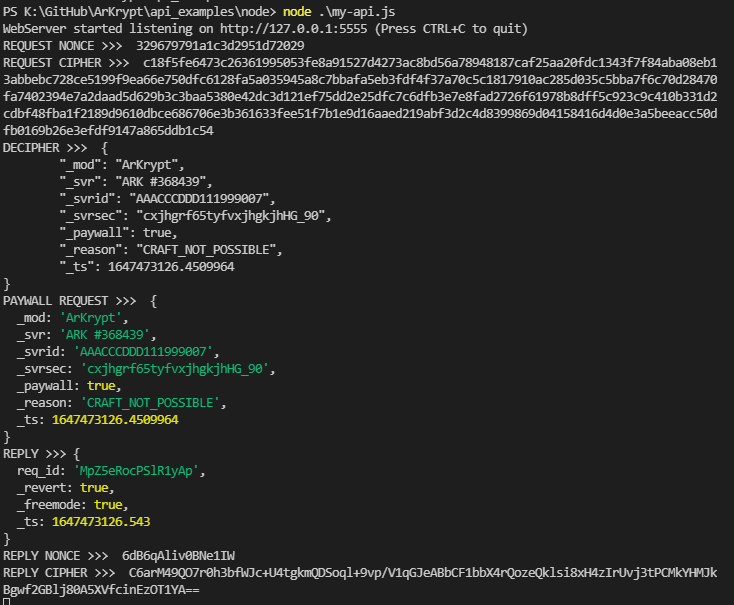
### Demo UI - Server Paywall - Python
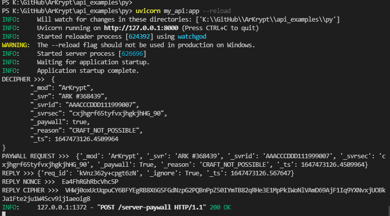
### Demo UI - Server Paywall - PHP
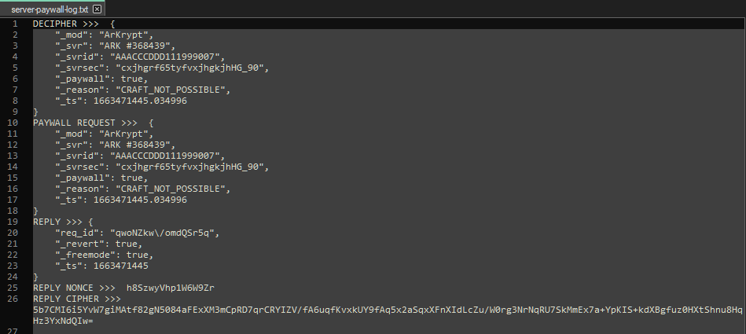

### Demo UI - Global Config - PIE
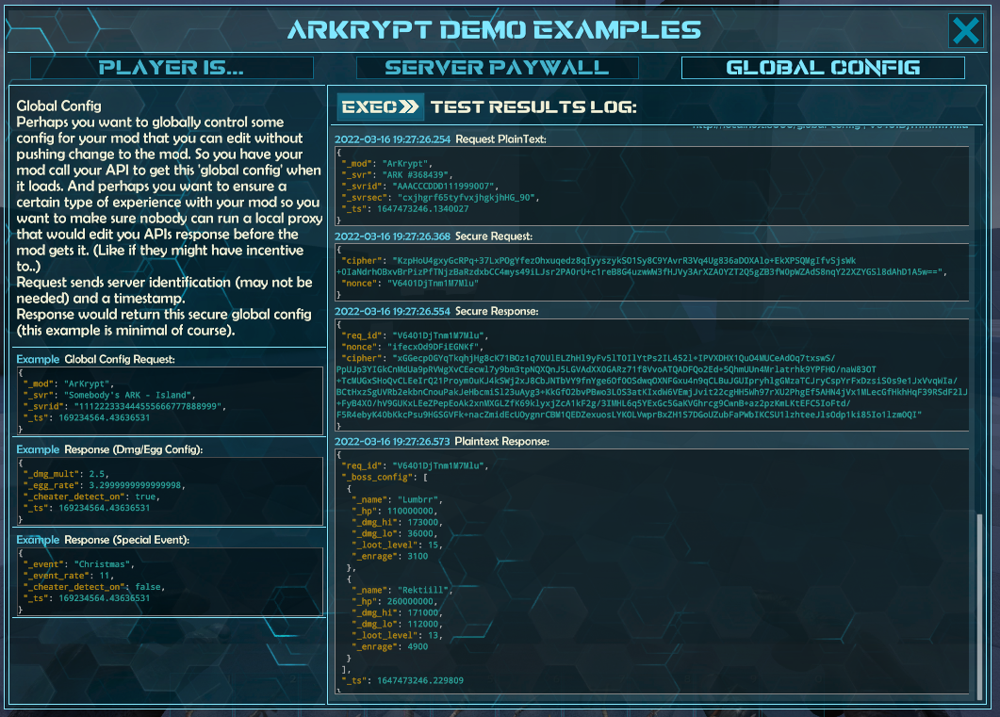
### Demo UI - Global Config - NodeJS
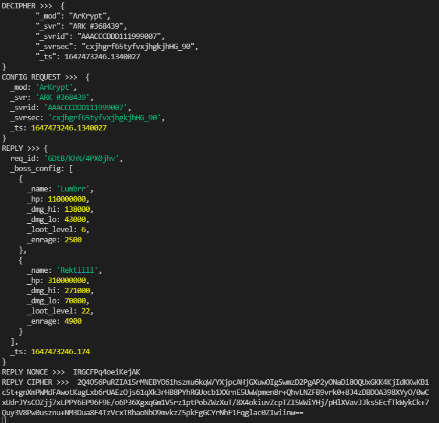
### Demo UI - Global Config - Python
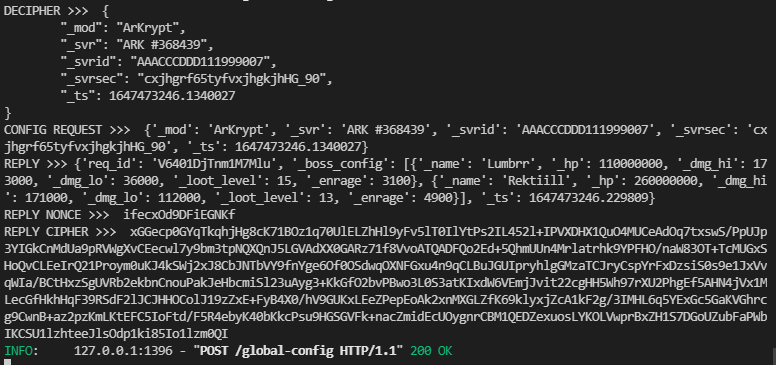
### Demo UI - Global Config - PHP
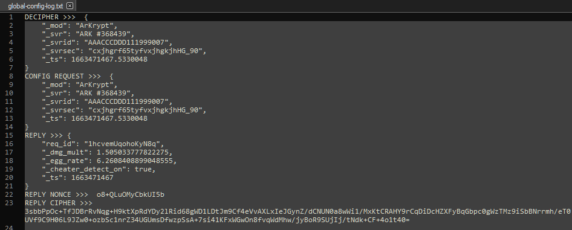

### XAMPP - Apache Config
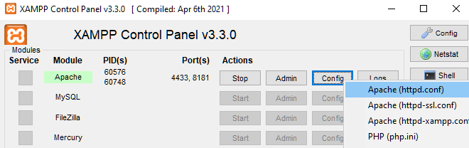
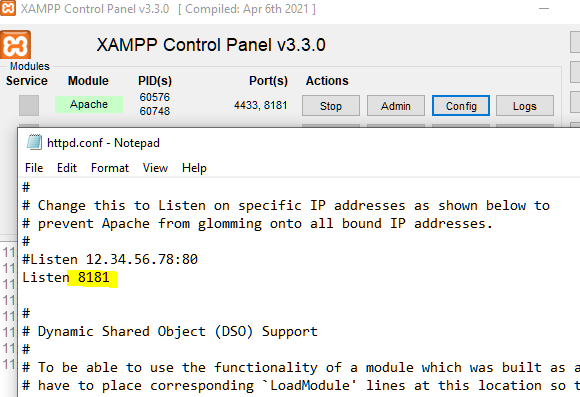
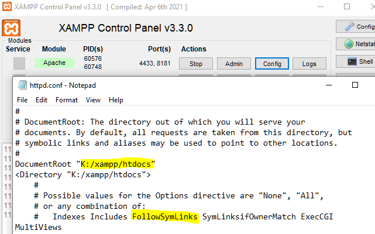